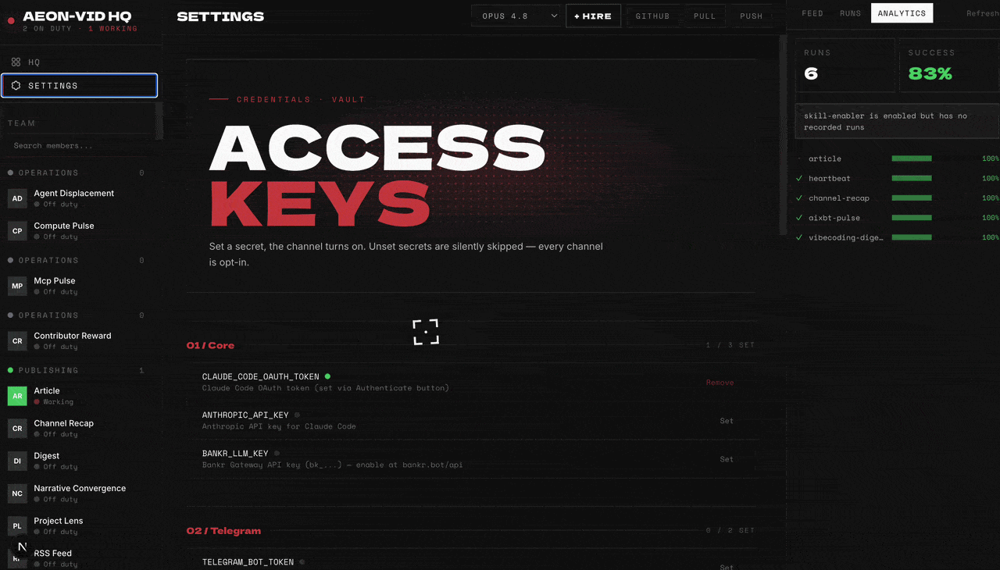

# AEON

<p align="center">
  
</p>

<p align="center">
  <a href="https://github.com/aaronjmars/aeon/stargazers"></a>
  <a href="https://github.com/aaronjmars/aeon/network/members"></a>
  <a href="https://x.com/aeonframework"></a>
</p>

<p align="center">
  <strong>The most autonomous agent framework.</strong><br>
  Give it a direction and it gets the work done: ships features to your repos, finds and privately discloses real vulnerabilities, deploys live apps, runs deep research, and writes new skills for itself. No approval loops. No babysitting. Configure once, forget forever.
</p>

<p align="center">
  
</p>

---

## Quick start

You need three things:

1. **Node.js 20+** - grab the LTS installer from [nodejs.org](https://nodejs.org/en/download), or use a package manager: `brew install node` (macOS), `winget install OpenJS.NodeJS.LTS` (Windows), `nvm` or your distro's package manager (Linux). Already have it? `node -v` should print 20 or higher.
2. **[GitHub CLI](https://cli.github.com/) (`gh`), authenticated** - the dashboard uses it for everything (secrets, workflows), and `./aeon` checks it before starting. Install via your package manager, then run `gh auth login` and follow the prompts.
3. **Your own copy of this repo** - click **Use this template** at the top of the repo page (keep it public; Actions minutes are free on public repos). CLI version: `gh repo fork aaronjmars/aeon --clone`.

```bash
git clone https://github.com/<you>/aeon   # skip if you used `gh repo fork --clone`
cd aeon && ./aeon
```

Open [http://localhost:5555](http://localhost:5555) and follow the four steps:

1. **Authenticate** - connect your Claude Pro/Max subscription, your X account (for the Grok harness), or paste an API key (Anthropic, Anthropic-compatible, or an LLM gateway key). The provider is auto-detected from the key prefix.
2. **Add a channel** - [Telegram, Discord, Slack, or email](#notifications) so Aeon can talk to you.
3. **Pick skills** - toggle what you want, set schedules. Each skill shows the API keys and MCP servers it needs, with one-click setup.
4. **Run** - hit **Run now** on any skill to try it immediately. When you change config (schedules, toggles), **Push** commits it to GitHub in one click so Actions runs it on cron.

That's it. Aeon now runs unattended.

**Prefer the terminal?** Everything the dashboard does is also a command: `./aeon skills ls`, `./aeon skills enable <name>`, `./aeon secrets set …`, `./aeon runs logs <id>`. Same logic, no browser, scriptable with `--json`. See [Command line](apps/cli/README.md).

<details>
<summary><strong>No admin rights / can't install <code>gh</code>?</strong></summary>

Grab the `gh_*_macOS_arm64.zip` (or your platform's binary) from [github.com/cli/cli/releases](https://github.com/cli/cli/releases) and drop it on your `PATH` (e.g. `~/.local/bin`). Then `gh auth login`.
</details>

---

## What Aeon can do

**A skill is a Markdown file: some frontmatter, then a prompt.** No plugin API, nothing to compile. Here's a real one, trimmed:

```yaml
# skills/digest/SKILL.md
---
name: digest
category: basics                 # which pack it belongs to
description: Generate and send a digest on a configurable topic
requires: [XAI_API_KEY?]         # ? = optional key, bare = required
var: ""                          # per-run input - "solana", "rust", "AI agents"…
mode: write
---
```
> Today is ${today}. Generate and send a daily **${var}** digest.
> 
> The whole point of a digest is **signal, not volume**. A reader skimming for 60 seconds should walk away with three things they didn't know that morning and one of them should change a decision they'd make this week. Anything that doesn't clear that bar gets cut.

The prompt *is* the skill, judgment and all. You schedule it, hand it a `var`, chain it into others, and Haiku rates every run. **Six packs ship in the box** - Core, Evolution, and Basics are on by default; enable the rest in the dashboard's **Packs** view. Full catalog below; how packs work: [`docs/skill-packs.md`](docs/skill-packs.md).

| Pack | Key | Skills | Examples |
| --- | --- | --- | --- |
| **Core** - fleet coordination, self-config, liveness | `core` | 11 | `fleet-control`, `spawn-instance`, `auto-workflow` |
| **Evolution** - authors, evolves, installs & heals its own skills | `evolution` | 7 | `create-skill`, `autoresearch`, `skill-repair` |
| **Basics** - simple, immediately-runnable skills | `basics` | 13 | `digest`, `token-movers`, `pr-review` |
| **Dev & Code** | `dev` | 8 | `github-monitor`, `feature`, `deploy-prototype` |
| **Crypto & Markets** | `crypto` | 12 | `token-pick`, `defi-overview`, `ctrl` |
| **Productivity** | `productivity` | 8 | `mention-radar`, `send-email`, `okf-export` |

### It heals itself
Every skill output is automatically scored 1–5 by Haiku after each run. Scores and failure flags are tracked per skill in `memory/skill-health/` with a rolling 30-run history. When something breaks, the loop fixes it without you:
1. **`heartbeat`** (daily) - detects failed, stuck, or chronically broken skills
2. **`skill-health`** - audits quality scores and flags API degradation patterns
3. **`skill-repair`** - diagnoses and patches failing skills automatically
4. **`self-improve`** - evolves prompts, config, and workflows based on performance

### It replicates
Aeon can spawn and manage copies of itself. `spawn-instance` forks the repo into a new specialized instance, selects relevant skills, and registers it in `memory/instances.json` - no secrets propagated, billing stays isolated. `fleet-control` health-checks and dispatches across instances.

### It ships real work
- **`feature`** - ships code unprompted to your watched repos or any repo with `var: external:<owner/repo>`.
- **`deploy-prototype`** - generates and deploys live web apps to Vercel.
- **`vuln-scanner`** - finds real code vulnerabilities and reports them privately through the maintainer's advisory channel, with proposed patches.
- **`autoresearch`** - evolves existing skills through scored variations.
- **`create-skill`** - generates new ones from a sentence.

### Add more skills
```bash
bin/add-skill aaronjmars/aeon --list        # browse the built-in catalog
bin/add-skill BankrBot/skills bankr hydrex  # install from any GitHub repo
bin/export-skill token-movers               # package one for standalone use
```
Installed skills land in `skills/` and are added to `aeon.yml` disabled - flip `enabled: true` to activate. You can also **build your own** from templates: `bin/new-from-template <template> <skill-name> --category <pack>`.

---

## Proof of work

Aeon's skills ship to production. These numbers are live at **[aeon.fun](https://www.aeon.fun)**.

| Skill | In production |
|-------|---------------|
| **`vuln-scanner`** | **~1.6M GitHub stars secured** - real vulnerabilities found, patched, and responsibly disclosed across 54 open-source projects (31 rated High/Critical). |
| **ecosystem** | **72 products & agents** built on Aeon. [`ECOSYSTEM.md`](docs/ECOSYSTEM.md) |
| **community** | **10 community skill packs** published to the registry. [`community-skill-packs.md`](docs/community-skill-packs.md) |

---

## Guardrails

Autonomy needs brakes. Aeon ships several, on by default or one flag away:
- **Read-only skills can't touch the repo.** A skill marked `mode: read-only` runs with no write, git, or `gh` tools. Post-run guards revert any stray writes.
- **Irreversible actions fail closed.** Money transfers preflight balances and dedupe per recipient. Disclosure emails sit behind daily caps. Failed sends stay failed; nothing retries blindly.
- **Optional authorization layer.** Point `FLEET_ENDPOINT` + `FLEET_TOKEN` at a self-hosted Fleet Watcher to gate every run. Fails closed when unreachable.
- **Secrets stay off the command line.** Auth'd calls go through `./secretcurl` with `{PLACEHOLDER}` tokens. The dashboard answers only to loopback until you allowlist a host.

Details: [`docs/CONFIGURATION.md`](docs/CONFIGURATION.md).

---

## Configure

### Schedules
All scheduling lives in `aeon.yml`:
```yaml
skills:
  article:
    enabled: true
    schedule: "0 8 * * *"       # daily at 8am UTC
  digest:
    enabled: true
    schedule: "0 14 * * *"
    var: "solana"               # topic for this skill
```
Standard cron format, all times UTC. Multiple due skills run in parallel. `depends_on:` controls ordering.

### The `var` field
Every skill accepts a single `var` - a universal input each skill interprets its own way:
| Skill type | What `var` does | Example |
|-----------|----------------|---------|
| Research & content | Sets the topic | `var: "rust"` → digest about Rust |
| Dev & code | Narrows to a repo | `var: "owner/repo"` → only review that repo's PRs |
| Crypto | Focuses on a token/wallet | `var: "solana"` → only check SOL price |
| Productivity | Sets the focus area | `var: "shipping v2"` → priority brief emphasizes v2 |

### Models & Authentication
Default model: `claude-sonnet-4-6` (configurable in `aeon.yml`). Supports `claude-opus-4-8`, `claude-fable-5`, `claude-haiku-4-5-20251001`, and per-skill overrides.

Aeon needs at least one way to reach a model. Add any in the dashboard's **Authenticate** modal:
- **Claude subscription** (`CLAUDE_CODE_OAUTH_TOKEN`)
- **Anthropic API** (`ANTHROPIC_API_KEY`)
- **LLM gateways** (Bankr, OpenRouter, Surplus, Venice, etc.)
- **Grok** (`GROK_CREDENTIALS` or `XAI_API_KEY`)

### Notifications
Set the secret → channel activates. No code changes needed.
| Channel | Outbound | Inbound |
|---------|---------|---------|
| Telegram | `TELEGRAM_BOT_TOKEN` + `TELEGRAM_CHAT_ID` | Same |
| Discord | `DISCORD_WEBHOOK_URL` | `DISCORD_BOT_TOKEN` + `DISCORD_CHANNEL_ID` |
| Slack | `SLACK_WEBHOOK_URL` | `SLACK_BOT_TOKEN` + `SLACK_CHANNEL_ID` |
| Email | `RESEND_API_KEY` + `NOTIFY_EMAIL_TO` | - |

**Restrict inbound commands:** Telegram is scoped to `TELEGRAM_CHAT_ID`. For Discord/Slack, set `DISCORD_ALLOWED_AUTHOR_ID` / `SLACK_ALLOWED_USER_ID` to ignore messages from unauthorized users.

### API keys per skill
Skills declare credentials in `requires:` frontmatter. The dashboard shows per-skey status, inline setup buttons, and a "used by" index. Skills can likewise declare MCP servers with `mcp: [base]`.

---

## Community Packs

Third-party skill collections in their own repos, installable as one bundle:

**One-click (dashboard).** Open the **Packs** view → **Community packs** → **Install pack**. Runs a security-scanned installer in the background and ships an auto-merging PR.

**CLI.**
```bash
bin/install-skill-pack AntFleet/aeon-skills
bin/install-skill-pack --list      # browse the registry
```

| Pack | Skills | Description |
|------|--------|-------------|
| [aeon-skills](https://github.com/AntFleet/aeon-skills) | 2 | Two-model-consensus PR review, x402 pay-per-call |
| [aeon-skill-pack-liquidpad](https://github.com/liquidpadbot/aeon-skill-pack-liquidpad) | 4 | Track LiquidPad on Base: burn alerts, launches, digest |
| [aeon-skill-pack-mneme](https://github.com/mnemedb/aeon-skill-pack-mneme) | 8 | Persistent memory layer: vector recall, entity graph, chain streams |
| [Polymarket Trader](https://github.com/SpartanLabsXyz/aeon-skill-pack-polymarket) | 3 | Signal, discovery, and real order-placing on Polymarket |

**To list a pack here**, open a PR that adds a table row **and** a matching [`catalog/skill-packs.json`](catalog/skill-packs.json) entry. Full checklist: [`docs/community-skill-packs.md`](docs/community-skill-packs.md).

---

## Reference & advanced

Everything above gets you running. The deeper reference lives in [`docs/`](docs) so this page stays short:

- **[Configuration & advanced](docs/CONFIGURATION.md)** - skill chaining, reactive triggers, scheduler frequency, capability modes, MCP in runs, cross-repo tokens, Fleet Watcher, remote dashboard.
- **[LLM gateways](docs/CONFIGURATION.md#llm-gateways)** - eight ways to power Claude Code, resolved by an automatic fail-over cascade.
- **[Harnesses](docs/harnesses.md)** - run skills on Claude Code or the Grok CLI; token accounting and per-skill knobs.
- **[Knowledge (OKF)](docs/OKF.md)** - Aeon's memory is a portable Open Knowledge Format bundle other agents can read.
- **[Use Aeon's skills from Claude](apps/mcp-server/README.md)** - every skill as an `aeon-<name>` MCP tool in Claude Desktop and Code.
- **[Command line](apps/cli/README.md)** - the whole dashboard as scriptable `./aeon` commands.
- **[Telegram instant mode](apps/webhook/README.md)** - ~1s replies via a self-hosted Cloudflare Worker.
- **[Observability](docs/langfuse.md)** and **[provenance](docs/attestation.md)** - optional Langfuse tracing and Sigstore attestation.
- **[Project layout](CONTRIBUTING.md#project-layout)** - an annotated tour of the repo.

---

Support the project: `0xbf8e8f0e8866a7052f948c16508644347c57aba3`
